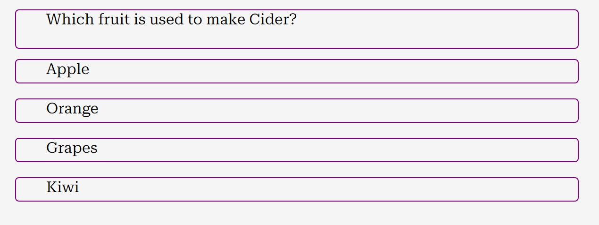

# CODE INSTITUTE - MILESTONE 2 PROJECT 2024

## FRUIT & VEGETABLE QUIZ

______________________________________________________________________________________________________________________________________________________________

### An application using HTML, CSS and JavaScript.

______________________________________________________________________________________________________________________________________________________________

## USER STORY

#### The user will want to use an application that:
 
        * the site works as expected 
        * allows intuitive navigation
        * have no distracting foregrounds
        * meets accessibility guidelines 
        * have clear information  
        * looks professional with consistent styling
        * consistent styling informs the user about consistent functionality. Knowing it will work as expected.
        * provides relevant information when required 
        * works on a number of devices (phones, tablets, laptops)
        

We will demonstrate the achievement of the user story through user story testing.

## SITE OWNER STORY

#### The site owner will:

        * provide a site to meet their customer needs
        * design a site designed using the five principles of UX design
        * have competant use CSS, HTML and JavaScript skills to build the site
        * test the site for easiy navigation and intuitively to use
        * ensure the site provides feedback to user while engaging with the web application
        * build a single application for a variety of devices like mobile phones,tablets and laptops/desktops
        * design a website wth consistent styling, legibility, and functionality

#### Strategy

        * To build a fun quiz app with interesting questions about fruit and vegetables
        * The end user is thought to have an interest in food or wish to learn more about food
        * Allows the site owner the experience to build webs 
          and using the experience to design apps for income
        * Building an web app for the common good can provide future income opportunities elsewhere                   
        
              
        Note:   
                * It is thought obesity crisis will cost Western Economies $4 trillion by 2035 
                * Obesity have a huge impact on personal health, discrimination, life expectancy,
                  social mobility and personal relationships.
                

#### Scope

Header

* To have a header with a title of the website incorporated as a logo

Main page

* To have a score area showing current score and question 
  count
* Question box showing question about fruit or vegetable
* Four clickable cards showing answer options
* User option selection shown on screen
* A feedback box appear, showing whether question is correct or not, with
  a call to action button for next question
* Card option turns colour indicating correct answer
* Score and question count updated for each question
* User is notified for end of quiz and is given a final score
* Another call for action button to restart quiz

Footer

* a simple footer - no links to social media as the focus is on the quiz

- - -

## DESIGN

#### Colours

Initially these colours were chosen for contrast while constructing the website and to help identify formatting conflicts. However, the proposed colours did not provide acceptable contrast to satisfy the accessiblity
criteria. 

The chosen colours contrasted nicely with either a black or white fonts. Thus aiding readability. Although there are a number of colours on the palette, some of them were mainly used to accentuate right, wrong answers and card answer selection. There is a subtle difference between white and smoke white. The colours are balanced, nicely contrasted with each other and does not overwhelm the user with colours. Also the coloured areas show nice separation such as the header, scoreboard and footer.

Green gives the user the vibe of right answer while red indicates wrong. Useful colours when writing a quiz app.

Main website colours:

#800080 - borders, scoreboard  
#ffa500 - background colour for feedback boxes and footer 
#4c161d - header 
#008000 - for background colour for card option with correct answer and background colour for tick 
#0000ff - for highlighting the user selected card by changing its left border  
#ffffff & #f5f5f5 - logo and main background colours  

Font colours:

Black
White

#### Typeface

Typeface: Roboto Serif and Handlee

Fonts were obtained from Google Fonts. 

I like Roboto Serif for its clarity and modern design without distracting the user in terms of readability.

Handlee font was chosen for its quirkiness, sharpness and with a modern feel.

Both fonts are easy to read.

_ _ _

#### Wiroframes

Initially wireframes were drawn up prior to coding but was changed midway due to the complexity of coding.

The wireframes provide some basic web structures and is a good indication on how the website will function

While the wiroframes isn't an exact representation of the final product, they are similar. 

The images 

#### Features

Favicon

Below is a the favicon feature with the initials of the website title and background colour of the header for design consistency.

Logo and header

Here is the logo following the consistent colours of the favicon. Also shown is the header page. 

Scoreboard

Scoreboard giving current score and quiz count index. Each count is incremented accordingly.

Question box with four answer card option

This shows the state of the quiz where the user has not yet answered the question.

Question box with four answer card option

Shows the state play after user selected the right answer. You can see the blue border indicating the user card selection. One of the cards turned green indicating the right answer.

Below the answer card is a box showing correct to let the user know the answer is correct. A symbol appears with a tick. Below the tick is a call to action button for next question. As you can imagine the user has received feedback from the colour changes and feedback box.

Question box with four answer card option - showing wrong

Shows the state play after user selected the wrong answer. You can see the blue border indicating the user card selection. One of the cards turned green indicating the right answer. As you can imagine the user has received feedback from the colour changes and feedback box.

Below the answer card is a box showing wrong to let the user know the answer is wrong. A symbol appears with a cross. Below the cross is a call to action button for next question. As you can imagine the user has received feedback from the colour changes and feedback box.

The user has reach the end of the quiz. The feedback box gives the final score with an option to replay the quiz.

Footer

A simple footer

- - - 

## TECHNOLOGY IMPLEMENTED

#### Language

HTML
CSS
JavaScript

#### Framework and Tools

Balsamiq
jQuery
Git
Github
Gitpod
Google Chrome tools
Coolers
Google Fonts
Favicon.io
Font Awesome

## BUGS & ISSUES

1) Fix double showing fontawesome icons on the feedback box by using toggleclass with boolean logic. Read up jQuery documentation guidance.

https://api.jquery.com/toggleClass/#:~:text=toggleClass(%20classNames%2C%20state%20),-classNames&text=Type%3A%20Array-,An%20array%20of%20classes%20to%20be%20toggled,element%20in%20the%20matched%20set.&text=Type%3A%20Boolean-,A%20boolean%20(not%20just%20truthy%2Ffalsy)%20value%20to%20determine,should%20be%20added%20or%20removed.

2) 16/01/24 - Fixed broken website. Copied and pasted last known worked files from Github into Gitpod and using git pull. Problem occurred after several erroneous copy and paste errors. 

3) Huge issue with using settimeout() function. I didn't realise it was asynchrous and caused an issue as I was expecting the function to be sequential. In the end I felt I couldn't trust this function. I decided to have a mouse driven quiz rather than a timer between questions.

4) Original site was clumsy in use before embarking on a new approach after discussing with my mentor.

5) Answer options continued to be selected after the first one was selected. Mentor suggested using enableOptions as a boolean flag to stop the other code from interacting with the event listener.

6) Problem with website scaling down to mobile devices and content spilling. Issue didn't occur on smaller devices. Issue was fixed after realising the media query width was set too low.

7) I had to swap my code on my own Gitpod account to a Code Institute one.

8) Answer cards were breaking up after using JavaScript hover codes with a boolean flag to stop it from hovering after click. Decided to remove the boolean flag and the app functionality returned to normal.

9) Issues with using the two link on the bottom of the body html. 

#### W3C -HTML

Button descendent of element with role - solved by creating a div styled similar to a button

Added semi-colon to &nbsp;

#### W3C - CSS

A few issues which were easily corrected:
            * display value with a property back to front (block-inline),
            * margin auto 0 with a comma in between
            * using flex-wrap: wrap with a property of none

#### JSHINT

No issues

## DEPLOYMENT

Deploying website in Github

Log into Github
Go to your repositories
Select your required repository
Click on settings
Select page on the left hand menu
Select branch to main, select folder to root and finally press save
A link will appear within your required repository under environments after several minutes
Website now live

Forking website

Log into Github
Go to your repositories
Go to the required repository
Click on the fork symbol to fork the code

## CREDITS

Special thanks to my mentor 

Guidance on toggle class with boolean logic 

https://api.jquery.com/toggleClass/#:~:text=toggleClass(%20classNames%2C%20state%20),-classNames&text=Type%3A%20Array-,An%20array%20of%20classes%20to%20be%20toggled,element%20in%20the%20matched%20set.&text=Type%3A%20Boolean-,A%20boolean%20(not%20just%20truthy%2Ffalsy)%20value%20to%20determine,should%20be%20added%20or%20removed.

MDN guidance on div 

https://developer.mozilla.org/en-US/docs/Web/Accessibility/ARIA/Roles/button_role

        
                                 

___________________________________________________________________________________________________

hr

fonts 

credits:

https://developer.mozilla.org/en-US/docs/Learn/HTML/Howto/Use_data_attributes

issues 

1 moving the jquery link to near the footer had caused the website to break. Thus moved backed

