# TESTING

## FRUIT & VEGETABLES

#### AUTOMATIC TESTING

### W3C HTML Validator

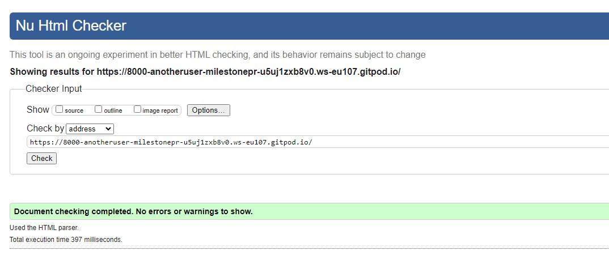

### W3C CSS Validator

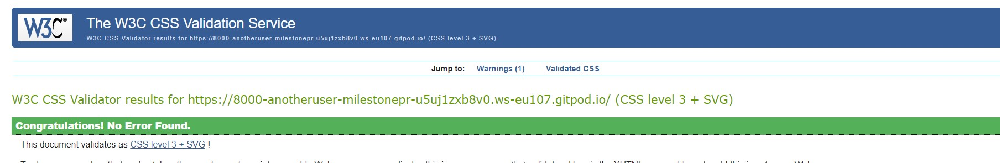

### JSHINT JavaScript Validator

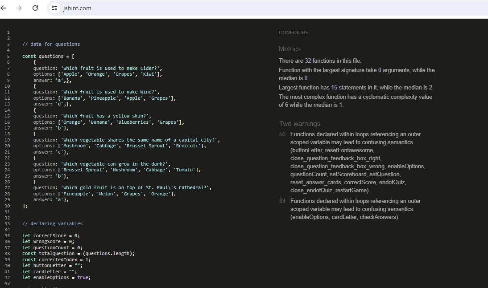

### LIGHTHOUSE - Desktop

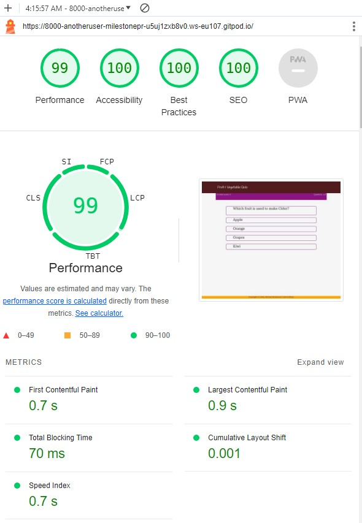

### LIGHTHOUSE - Mobile

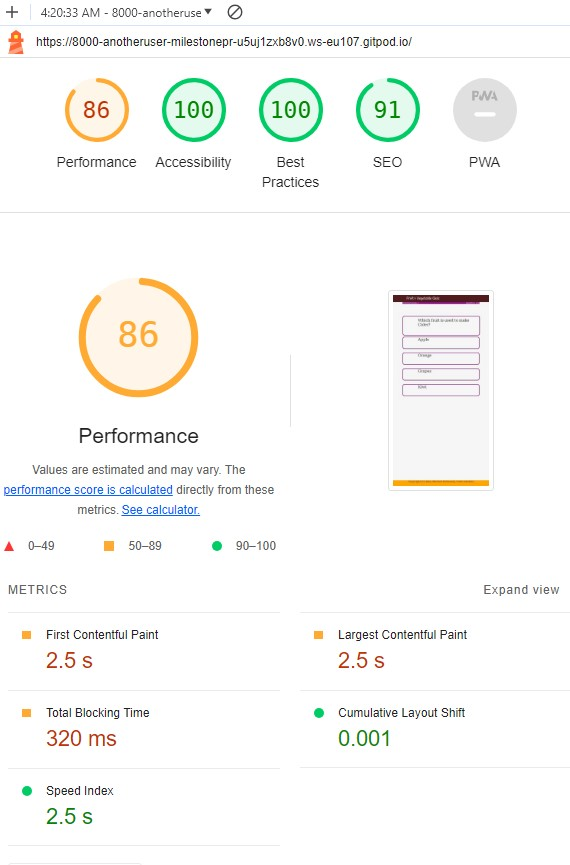

While the performance is slightly disappointing - this might be caused by testing on an old desktop computer with adblocking extensions on browser. In this respect 86% performance is not a bad score.

### MANUAL TESTING

Testing equipment: Desktop with a A4-3400g processor, Brave and Chrome browsers

#### USER STORY TESTING

It's a simple quiz where the user clicks on the relevant option as they progress on the quiz.

Action: Score count is zero, score index is 1 out of maximum number of questions, question is shown with four possible answer options. The answer options allows the use of JavaScript hover to let the user know this is a clickable option.

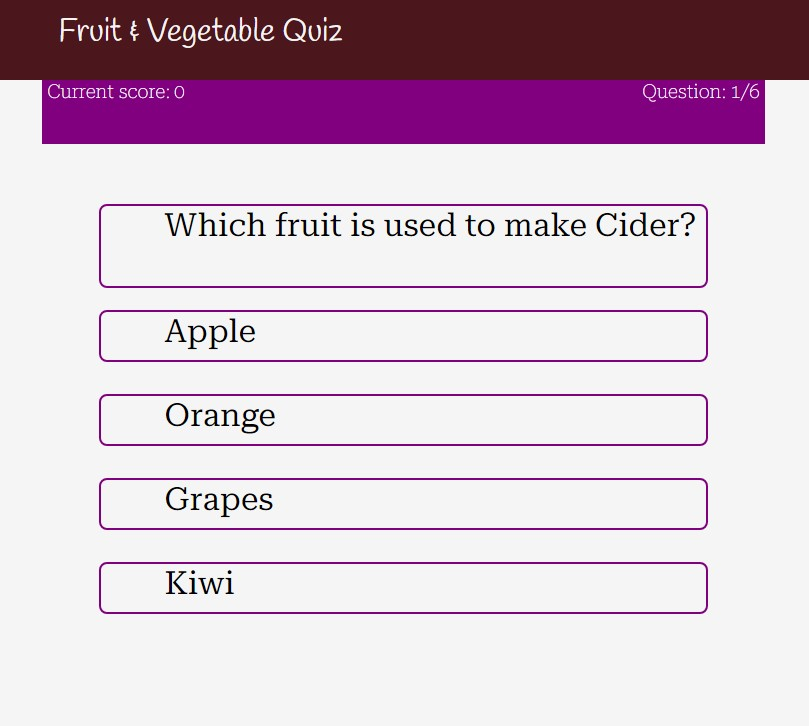

Expected Result: Takes you to the next screen with a feedback box letting you know if you have correctly answered the question or not

Actual result: As expected with Brave and Chrome browsers.

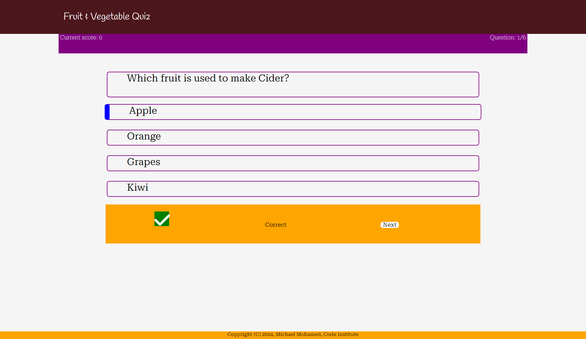

Action: To click on the feedback box to take you to the next question.

Expected result: Score is incremented depending if correctly answered. Question index increases by one. New set of questions. 

Actual result: As expected with Brave and Chrome browsers. Image below shows one of the answer options with a JavaScript hover effect.

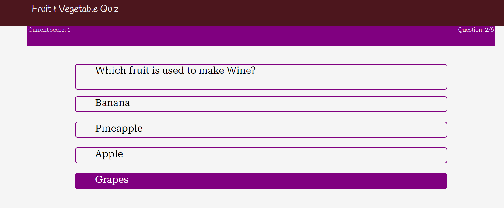

Action: Questions are looped as above until you answerd the final question.

Expected result: Score is incremented depending if correctly answered. Question index increases by one. An end of quiz feedback box appears giving final score.

Actual result: As expected with Brave and Chrome browsers.

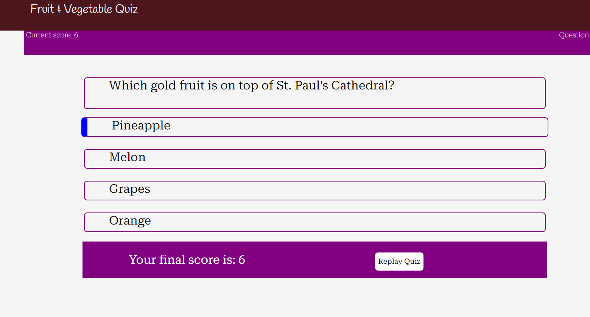

Action: To click on the end of quiz box to restart quiz.

Expected result: Score is set to zero. Question index resets to one. Question appears with four answer options

Actual result: As expected with Brave and Chrome browsers.

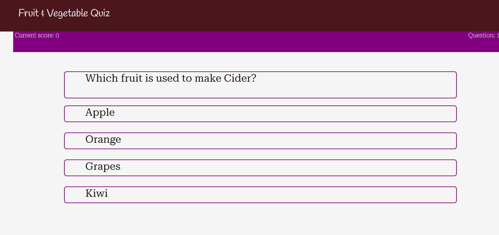

The reponsiveness of the website on different devices:

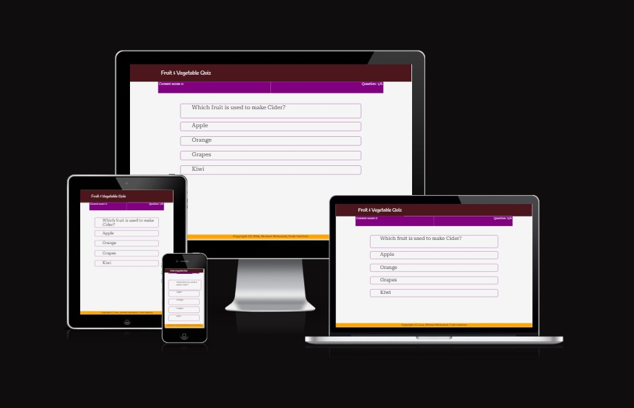

